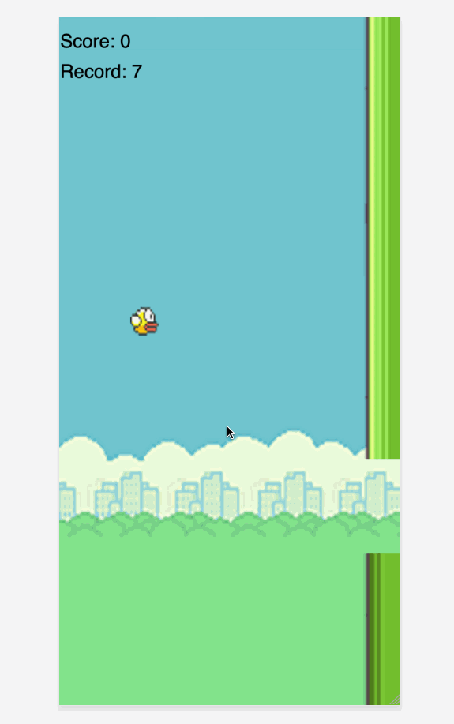

# Yet another Flappy Bird

This mimics the behavior of the Flappy Bird game using [P5](https://p5js.org/) canvas library.

## Preinstall

Make sure you have [NodeJs](https://nodejs.org/en/) installed on your machine.

I would recommend to use [Yarn](https://yarnpkg.com/), but surely, you can use NPM that is built-in NodeJs.

## Installation

1. Clone this repo
2. Run `npm install` or `yarn` in the terminal
3. Run `npm run start` or `yarn start`

## Appearance

The game should look like this:

